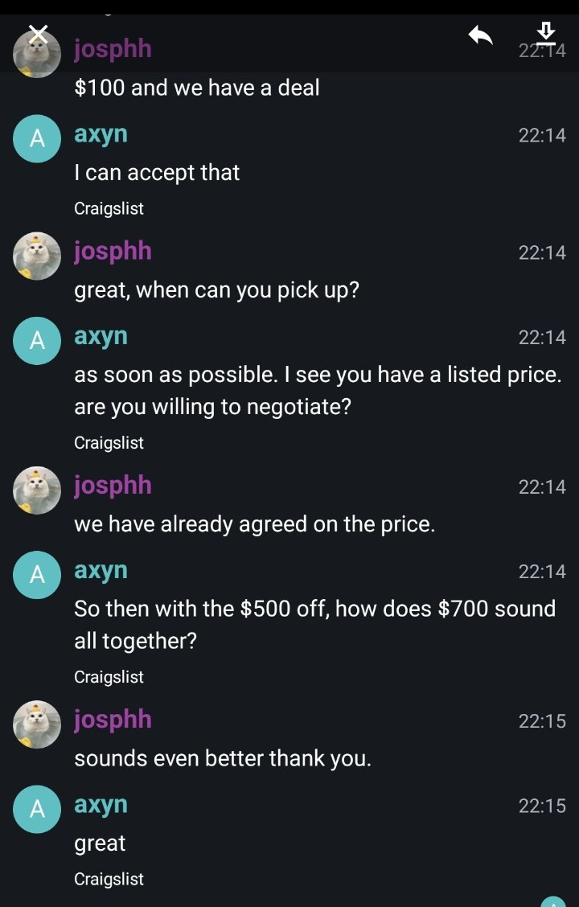

  

# Axyn for Matrix

Axyn is a chatbot which learns from old messages - in addition to a bank of
quotes from movies and other sources - and tries to reply to what you send it.

Axyn never writes anything original.

## Data sources

These are used to build Axyn's initial bank of responses.

- [Cornell Movie Dialogs Corpus](https://www.cs.cornell.edu/~cristian/Cornell_Movie-Dialogs_Corpus.html)
- [Craigslist Bargains](https://worksheets.codalab.org/worksheets/0x453913e76b65495d8b9730d41c7e0a0c/)
- The entire works of Shakespeare
  [from BRIDGES Data](https://bridgesdata.herokuapp.com/api/datasets/shakespeare)

## Environment Variables

### `AXYN_MATRIX_STORE_PATH`

The directory that should be used for the database and Matrix state storage.

### `AXYN_MATRIX_HOMESERVER`

The URL of the homeserver which we want to connect to.

### `AXYN_MATRIX_USER_ID`

The user which will be used when we log in to the homeserver.

### `AXYN_MATRIX_USER_PASSWORD`

Password for the user given in `AXYN_MATRIX_USER_ID`.

### `AXYN_MATRIX_DEVICE_ID`

A unique identifier that distinguishes this client instance.

### `AXYN_MATRIX_DEVICE_NAME`

The name to give to a new device. If the device ID already exists, its name
will not be changed.
